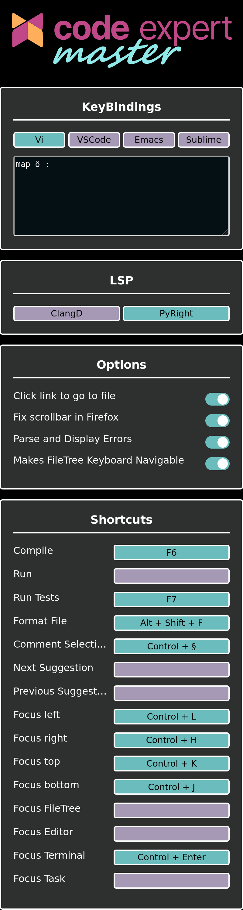

# cx-master
This extension adds cool stuff like a nice switch between Vim, VSCode and Ace keybindings.



## Extension
All the web Extension code is currently inside the `extension/` directory.
Code Expert uses `ace-builds` version 1.22.0 and `xterm` version `5.3.0` so when updating the package.json, make sure to keep these versions the same.

### Installing
#### Firefox
[Mozilla Addons](https://addons.mozilla.org/en-US/firefox/addon/code-expert-master/)

#### Chromium-Based Browsers
[Chrome WebStore](https://chromewebstore.google.com/detail/code-expert-master/fdmghidnemaceleocaolmgdkpegkhlcf)

### Building
Requires npm
```sh
cd extension
npm i

## One of
npm run package:firefox
npm run package:chrome
```
The generated Code will be in `dist/` and the packaged Zip will be in `out/`.


## cx-lsp
This Extension can connect to a Natively running LSP Server, but you need to have an Application installed.

### Native application
#### Automatic
**Windows:**
```ps1
Invoke-WebRequest "https://raw.githubusercontent.com/micha4w/cx-master/main/install.ps1" | Invoke-Expression
```

**Linux:**
```sh
bash <(curl -sS "https://raw.githubusercontent.com/micha4w/cx-master/main/install.sh")
```

### LSP Servers
You need to have the LSP servers that you want to use on CodeExpert installed on your PC.
For example to use the C++ Language Server (ClangD) you have to install it using:
```ps1
# Windows
winget install LLVM.clangd
# Debian / Ubuntu
sudo apt-get install clangd-12
```
More systems [here](https://clangd.llvm.org/installation.html)

For the Python LSP (PyRight) you need to have Python installed and then do:
```ps1
pip install pyright
# The libraries you want to use in CX need to be installed on your system
pip install numpy matplotlib scipy
```

#### Adding your own LSP Servers
If another language is added to CX, or you don't like the default LSPs, you can add your own by creating config files in `%APPDATA%\cx-master\lsps` on windows or `$XDG_DATA_DIR\cx-master\lsps` on linux. Check out the files that are already in the directory to see how it works.

To get the needed mode, open CX at the file you want to add an LSP for and run
```js
ace.edit('ace-editor').session.getMode().$id;
```
in the browser console, then take out the last part of the path (e.g. ace/mode/c_cpp -> c_cpp)


### Building clangd to WASM
This Chapter is just an info, I tried to get clangd working as a WASM WebWorker, but it ended up not working well, if you would love to try around yourself, here's the build that I ended up with:

Need docker installed
```sh
wget https://github.com/llvm/llvm-project/archive/refs/tags/llvmorg-16.0.6.tar.gz
tar xf llvmorg-16.0.6.tar.gz
```
Once it finished unpacking, copy `cx-master/clangd-wasm/src/wrap-io.cpp` and `cx-master/clangd-wasm/web/settings.js` into the unpacked folder.
Then you need to inject some Code at the very end of clangd's `CMakeLists.txt`, located at `./llvm-project-llvmorg-16.0.6/clang-tools-extra/clangd/CMakeLists.txt`
```cmake
if (${CMAKE_SYSTEM_NAME} MATCHES "Emscripten")
    set_target_properties(Engine PROPERTIES LINK_FLAGS "-sDEFAULT_LIBRARY_FUNCS_TO_INCLUDE='$stringToNewUTF8' -sASYNCIFY -pthread -sPROXY_TO_PTHREAD -sEXIT_RUNTIME=1 -Wl,--wrap=fgets,--wrap=fread --pre-js=/src/settings.js")
    target_sources(clangDaemon PUBLIC /src/wrap-io.cpp)
endif()
``` 


```sh
THREADS=6
docker run \
  --rm \
  -v $(pwd)/llvm-project-llvmorg-16.0.6:/src \
  -u $(id -u):$(id -g) \
  -it \
  emscripten/emsdk \
  sh -c "
    cmake -S llvm -B build-host -DCMAKE_BUILD_TYPE=Release -DLLVM_ENABLE_PROJECTS='clang;clang-tools-extra' -Wno-dev
    cmake --build build-host --target clang-tblgen llvm-tblgen clang-tidy-confusable-chars-gen -j $THREADS

    CXXFLAGS='-Dwait4=__syscall_wait4' \
    LDFLAGS='-sDEFAULT_LIBRARY_FUNCS_TO_INCLUDE=\$stringToNewUTF8 \
             -sASYNCIFY -pthread -sPROXY_TO_PTHREAD -sEXIT_RUNTIME=1 \
             -Wl,--wrap=fgets,--wrap=fread \
             --pre-js web/settings.js' \
    emcmake cmake -S llvm -B build -DCMAKE_BUILD_TYPE=Release -DLLVM_ENABLE_PROJECTS='clang;clang-tools-extra' -Wno-dev \
        -DLLVM_TABLEGEN=/src/build-host/bin/llvm-tblgen \
        -DCLANG_TABLEGEN=/src/build-host/bin/clang-tblgen \
        -DCLANG_TIDY_CONFUSABLE_CHARS_GEN=/src/build-host/bin/clang-tidy-confusable-chars-gen
    emmake cmake --build build --target clangd -j $THREADS
    "
```
